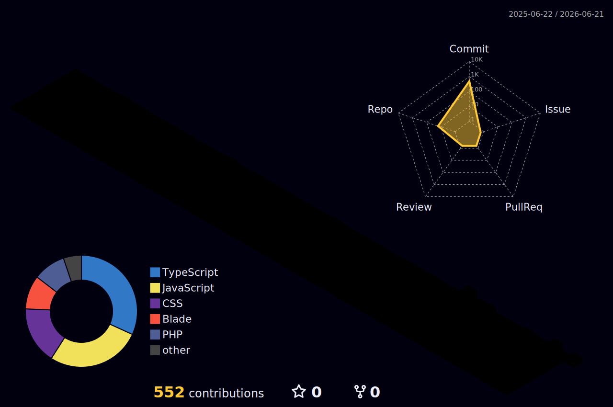

 

---

### About Me

- 🚀 Full Stack Engineer with **4+ years** building production-grade web applications
- 🏗️ Specialize in **SaaS platforms, AI-powered apps, marketplaces & business systems**
- 🌍 Worked with startups and agencies across **healthcare, logistics, real estate & eCommerce**
- 🤖 Passionate about **AI integrations, automation & scalable backend systems**
- 📍 Based in **Faisalabad, Pakistan** — open to remote work & collaborations
- 💬 Ask me about **Laravel, MERN Stack, Next.js, DevOps, AI integrations**
- 📬 Reach me at **hassanjamal8735@gmail.com**

---

### What I Do

| Area | Skills |
|---|---|
| 🎨 **Frontend** | React.js, Next.js, TypeScript, Tailwind CSS, JavaScript |
| ⚙️ **Backend** | Laravel, PHP, Node.js, Express.js, Python, GraphQL, REST APIs |
| 🗄️ **Databases** | MySQL, PostgreSQL, MongoDB, Redis |
| ☁️ **DevOps & Cloud** | AWS, Docker, Vercel, CI/CD Pipelines |
| 🤖 **AI & Automation** | OpenAI API, LangChain, n8n, AI Agents |
| 🛒 **CMS & eCommerce** | WordPress, Shopify, WooCommerce, Stripe |

---

### Tech Stack

**Backend**

**Frontend**

**Databases**

**DevOps & Cloud**

**AI & Automation**

---

### GitHub Trophies

---

### GitHub Stats

---

### Contribution Graph

---

### 3D Contribution Calendar

---

### Profile Summary

---

### Featured Projects

| Project | Description | Stack |
|---|---|---|
| [**Diabetes Prediction FYP**](https://github.com/Hassan-Jamal8735/Diabetes-Prediction-FYP) | AI-powered diabetes prediction system with mobile app, admin dashboard & ML model | Python · TypeScript · Dart · Jupyter |
| [**GlowNest**](https://github.com/Hassan-Jamal8735/GlowNest) | Full-featured product platform built with modern web technologies | TypeScript |
| [**Ai Image Generator**](https://github.com/Hassan-Jamal8735/Ai_Image_Generator) | AI-powered image generation app using modern AI APIs | JavaScript |
| [**weeshare**](https://github.com/Hassan-Jamal8735/weeshare) | Social sharing platform | JavaScript |
| [**PayBack Fitness App**](https://github.com/Hassan-Jamal8735/PayBack-Fitness_App) | Fitness tracking mobile application | TypeScript |
| [**NextJS Portfolio**](https://github.com/Hassan-Jamal8735/NextJS_PortFolio) | Developer portfolio built with Next.js | TypeScript |

---

  

